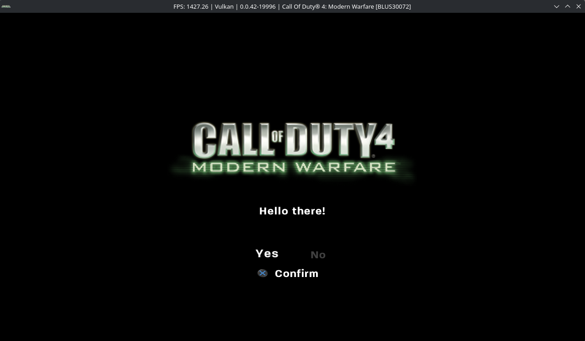

# COD4 PS3 Update Server

A small Rust HTTP server that emulates the update endpoint used by the Call of Duty 4 PS3 updater.

It serves the update manifest and payload expected by the client. The original updater verifies downloaded files using RSA-PSS with a Tiger hash, so arbitrary custom files require the client to trust a matching public key.



## Build

```bash
cargo build --release
```

The binary will be created at:

```text
target/release/cod4-update-server
```

## Run

Basic transport test:

```bash
sudo ./target/release/cod4-update-server \
  --file ./payload.bin \
  --diagnostic-unsigned \
  --bind 0.0.0.0:80 \
  --title BLUS30072 \
  --current 1.3 \
  --version 1.4 \
  --destination payload.bin
```

`--diagnostic-unsigned` lets the updater download the file, but the original client will reject it during signature verification. This is useful for testing DNS, HTTP and the update flow.

## Serving a custom signed payload

Generate a local 1024-bit RSA key pair:

```bash
openssl genrsa -traditional -out local_private.pem 1024
openssl rsa -in local_private.pem -RSAPublicKey_out -outform DER -out local_public.der
```

Then run:

```bash
sudo ./target/release/cod4-update-server \
  --file ./payload.bin \
  --private-key ./local_private.pem \
  --public-key ./local_public.der \
  --bind 0.0.0.0:80 \
  --title BLUS30072 \
  --current 1.3 \
  --version 1.4 \
  --destination payload.bin
```

The updater must be patched to use the matching public key. Without that change, it will only accept payloads signed with the original publisher key.

## DNS

The updater connects to:

```text
cod4mw-ps3update.charlieoscardelta.com
```

Redirect that hostname to the machine running the server. For example with `/etc/hosts`:

```text
192.168.0.10 cod4mw-ps3update.charlieoscardelta.com
```

Or with `dnsmasq`:

```text
address=/cod4mw-ps3update.charlieoscardelta.com/192.168.0.10
```

The original client uses HTTP on port 80.

## Useful options

```text
--file PATH             Payload to serve
--bind ADDR             Listen address, default: 0.0.0.0:80
--title ID              Title ID, default: BLUS30072
--current VERSION       Version currently expected by the client
--version VERSION       Version advertised by the server
--destination PATH      Destination filename/path from the manifest
--signature PATH        Use an existing Base64 signature
--private-key PATH      Sign the payload with a local PKCS#1 PEM key
--public-key PATH       Verify that the supplied public key matches
--diagnostic-unsigned   Serve an intentionally invalid signature
--no-update             Return no update while still serving the payload
```

Run `--help` for all options.

## Logs

Runtime logs are written to:

```text
logs/session-*.jsonl
```

## Notes

- The client expects `Content-Length`; chunked transfer is not used.
- The entire payload is buffered in PS3 memory, so very large files are not practical.
- A downloaded and correctly signed file still has to be a format the updater/game can actually use.
